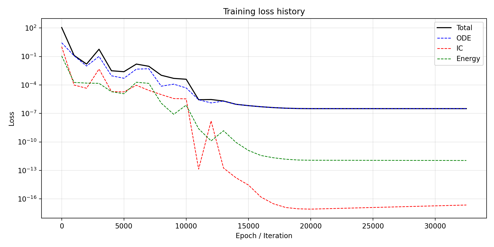
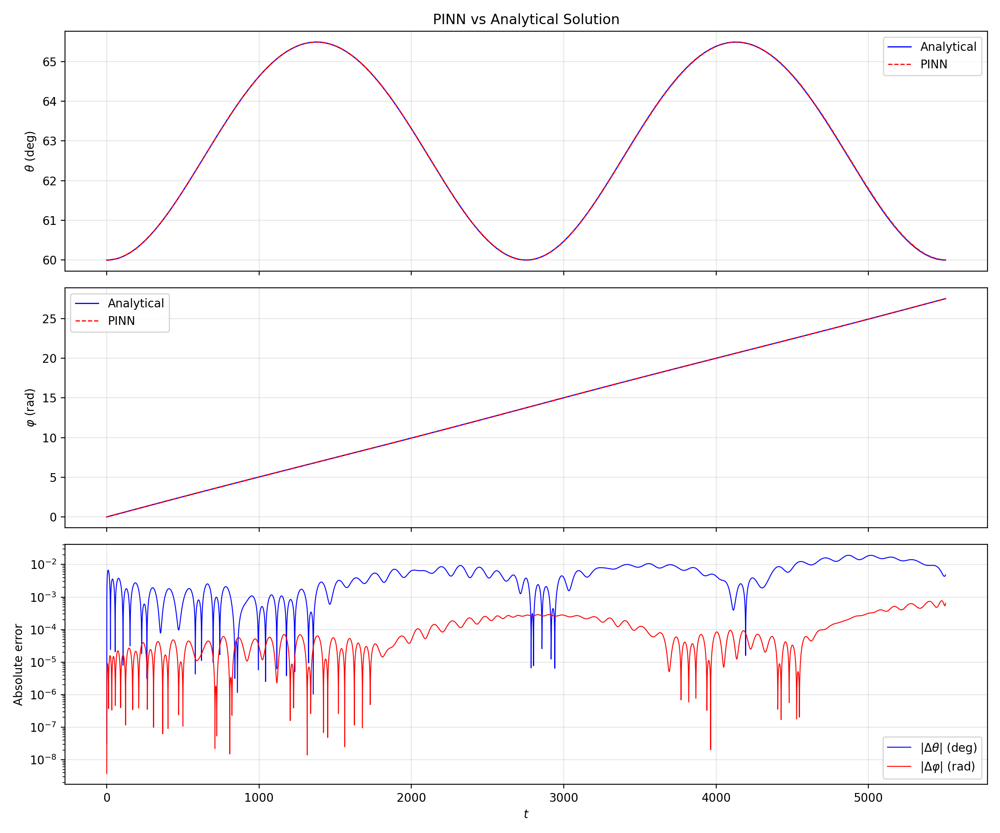
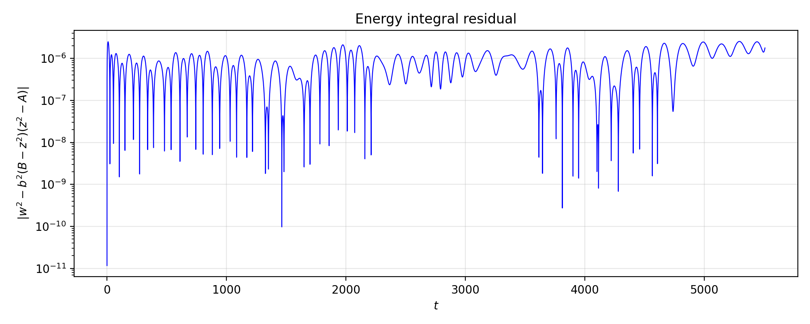
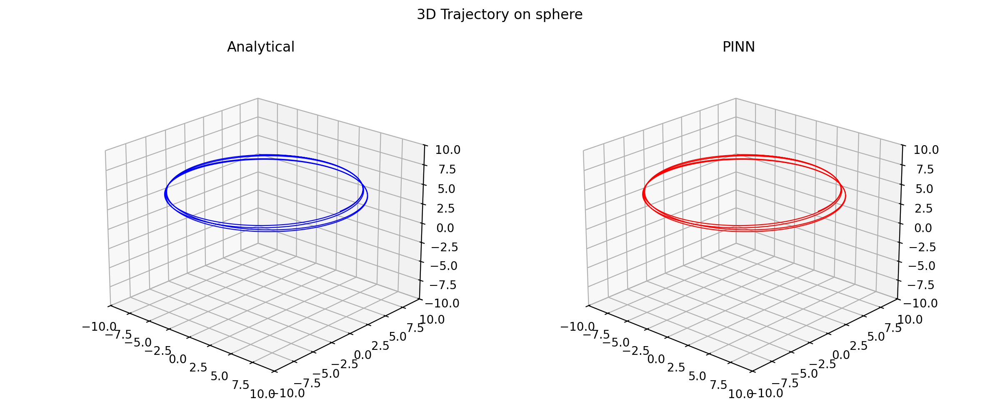

# PINN Forward: Problema de Störmer restrito à esfera (Issue #4)

**Data**: 2026-03-08
**Referência**: Piña & Cortés, *Eur. J. Phys.* **37** (2016) 065009 — *"Störmer problem restricted to a spherical surface and the Euler and Lagrange tops"*

---

## 1. Descrição do Problema

Partícula carregada confinada a uma superfície esférica de raio $R$, sob a ação de um dipolo magnético no centro da esfera. O Hamiltoniano em coordenadas esféricas $(\theta, \varphi)$ é:

$$H = \frac{1}{2MR^2}\left[p_\theta^2 + \frac{(p_\varphi + k\sin^2\theta)^2}{\sin^2\theta}\right]$$

onde $M$ é a massa, $k = \mu_0 q m / (4\pi R)$ é o acoplamento magnético, e $p_\varphi$ é constante do movimento (coordenada cíclica).

### Parâmetros físicos utilizados

| Parâmetro | Valor |
|-----------|-------|
| $M$ (massa) | 2.0 |
| $R$ (raio) | 10.0 |
| $k$ (acoplamento magnético) | 0.5 |

### Adimensionalização

Definindo $L = \sqrt{2MR^2 K}$ (momento característico) e $\tau = t/\tau_\text{scale}$ com $\tau_\text{scale} = \sqrt{MR^2/(2K)}$:

$$a = \frac{p_\varphi}{L}, \quad b = \frac{k}{L}$$

A substituição $z = \cos\theta$ transforma o problema no sistema:

$$\dot{z}^2 = b^2(B - z^2)(z^2 - A)$$

onde $A$ e $B$ são raízes do polinômio quártico $V(z) = \frac{b^2}{2}(z^2-A)(z^2-B)$, com $A + B = 1 + 2ab + a^2$ e $AB = a^2$.

A solução analítica usa **funções elípticas de Jacobi**: $\text{dn}$ para regime de um hemisfério ($A > 0$), $\text{cn}$ para cruzamento do equador ($A < 0$).

---

## 2. Solução Analítica — Implementação e Validação

### 2.1 Implementação

Arquivo: `problems/stormer-problem/analytical/stormer_sphere_analytical.py`

A solução analítica foi implementada em Python usando `scipy.special.ellipj` para as funções elípticas de Jacobi e `scipy.integrate.cumulative_trapezoid` para a integração numérica de $\varphi(t)$:

$$\frac{d\varphi}{d\tau} = \frac{a}{1 - z^2} + b$$

Para condições iniciais arbitrárias (com $p_\theta \neq 0$), foi necessário computar um offset de fase $u_0$ no argumento das funções elípticas, resolvido via inversão por bisseção.

### 2.2 Validação contra integrador Störmer-Verlet

Arquivo: `problems/stormer-problem/analytical/validate_analytical.py`

A solução analítica foi comparada com o integrador simplético em C (`sv_sphere.c`, $\Delta t = 0.0002$) para 4 casos distintos:

| Caso | Regime | $\theta$ erro médio | $\varphi$ erro médio | Resíduo ODE |
|------|--------|---------------------|----------------------|-------------|
| fig6b (um hemisfério) | $A > 0$ | ~1e-3 | ~1e-3 | ~1e-14 |
| fig6c (loops) | $A < 0$ | ~1e-3 | ~1e-3 | ~1e-14 |
| fig7a (hemisfério, $p_\theta \neq 0$) | $A > 0$ | ~1e-3 | ~1e-3 | ~1e-14 |
| fig7c (cruza equador) | $A < 0$ | ~1e-3 | ~1e-3 | ~1e-14 |

O resíduo ODE ($\dot{z}^2$ vs $b^2(B-z^2)(z^2-A)$) ficou na ordem de $10^{-14}$ (precisão de máquina), confirmando a correção da solução analítica. O erro ~$10^{-3}$ na comparação com Störmer-Verlet é consistente com o erro do integrador numérico ($\Delta t = 0.0002$).

---

## 3. PINN — Tentativas e Evolução

### 3.1 Tentativa 1: Equações de Hamilton em tempo físico

**Formulação**: rede neural $(\theta, p_\theta, \varphi) = \text{NN}(t)$ com as equações de Hamilton originais:

$$\dot{\theta} = \frac{p_\theta}{MR^2}, \quad \dot{p}_\theta = \frac{(p_\varphi + k\sin^2\theta)\cos\theta}{MR^2\sin^3\theta}\left[(p_\varphi + k\sin^2\theta) - 2k\sin^2\theta\right]$$

**Resultado**: Loss ficou estagnada em ~2300, validação com $\theta_\text{MAE} = 3.6$ rad (essencialmente aleatório).

**Causa raiz**: O fator de escala $1/T_\text{final} \approx 7 \times 10^{-5}$ (com $T_\text{final} \approx 5507$) suprimia os gradientes da ODE, tornando a perda de condição inicial dominante e a perda física irrelevante.

### 3.2 Tentativa 2: Formulação adimensional em $\theta$

**Formulação**: tempo adimensional $\tau_\text{norm} \in [0, 1]$, Fourier features, rede prediz $(\theta, p_\theta, \varphi)$ com ODEs adimensionais:

$$\frac{d\theta}{d\tau} = -\frac{p_\theta}{L\sin\theta}, \quad \frac{dp_\theta}{d\tau} = \frac{\cos\theta}{L\sin^3\theta}\left[(a + \sin^2\theta)((a + \sin^2\theta) - 2\sin^2\theta)\right]$$

**Resultado**: Loss explodiu para NaN imediatamente (loss ODE inicial: $1.3 \times 10^{13}$).

**Causa raiz**: O termo $1/\sin^3\theta$ é singular em $\theta = 0$ e $\theta = \pi$. Durante o treinamento, os pesos da rede inicialmente produzem valores arbitrários de $\theta$, incluindo valores próximos dos polos, causando explosão numérica.

### 3.3 Tentativa 3 (final): Formulação em $z = \cos\theta$ — Convergência

**Formulação**: substituição $z = \cos\theta$, $w = dz/d\tau$, eliminando completamente a singularidade:

$$\frac{dz}{d\tau} = w$$
$$\frac{dw}{d\tau} = b^2 z(A + B - 2z^2)$$
$$\frac{d\varphi}{d\tau} = \frac{a}{1 - z^2} + b$$

**Por que funciona**:
- Todos os coeficientes da ODE são $O(1)$ — não há fator de escala suprimindo gradientes
- Não há singularidade em $z = \pm 1$ (os polos correspondem a $1 - z^2 = 0$, mas a trajetória fisica nunca alcança os polos para $A > 0$)
- O pequeno epsilon ($10^{-8}$) no denominador de $\varphi$ previne instabilidade numérica
- Integral de energia $w^2 = b^2(B-z^2)(z^2-A)$ serve como constraint adicional

---

## 4. Arquitetura Final da PINN

### 4.1 Rede Neural

Arquivo: `problems/stormer-problem/nn/pinn_stormer.py`

| Componente | Especificação |
|------------|---------------|
| Entrada | $\tau_\text{norm} \in [0, 1]$ (tempo adimensional normalizado) |
| Fourier features | $[\tau, \sin(2\pi f_i \tau), \cos(2\pi f_i \tau)]$, $f_i \in \{1, ..., 10\}$ → dim = 21 |
| Camadas ocultas | 4 camadas, 128 neurônios cada |
| Ativação | $\tanh$ |
| Saída | 3 valores: $(z, w, \varphi)$ |
| Inicialização | Xavier normal (pesos), zeros (bias) |
| Precisão | `float64` |
| Total de parâmetros | ~51.000 |

### 4.2 Função de Perda

$$\mathcal{L} = \omega_\text{ode} \mathcal{L}_\text{ode} + \omega_\text{ic} \mathcal{L}_\text{ic} + \omega_\text{energy} \mathcal{L}_\text{energy}$$

- $\mathcal{L}_\text{ode}$: resíduo médio quadrático das 3 ODEs nos pontos de colocação (3000 pontos LHS)
- $\mathcal{L}_\text{ic}$: erro quadrático nas condições iniciais ($z_0, w_0, \varphi_0$) em $\tau = 0$
- $\mathcal{L}_\text{energy}$: violação da integral de energia $|w^2 - b^2(B-z^2)(z^2-A)|^2$

| Peso | Valor | Justificativa |
|------|-------|---------------|
| $\omega_\text{ode}$ | 1.0 | Base |
| $\omega_\text{ic}$ | 100.0 | Prioriza satisfação das condições iniciais |
| $\omega_\text{energy}$ | 10.0 | Constraint de conservação como regularizador |

### 4.3 Estratégia de Treinamento

Arquivo: `problems/stormer-problem/nn/train.py`

**Fase 1 — Adam** (20.000 épocas):
- Learning rate inicial: $10^{-3}$
- Scheduler: Cosine annealing ($\eta_\text{min} = 10^{-6}$)
- Gradient clipping: $\|\nabla\|_\text{max} = 1.0$

**Fase 2 — L-BFGS** (5 passos externos):
- `max_iter=20`, `max_eval=25` por passo
- `history_size=100`
- Line search: Strong Wolfe
- Tolerâncias: `grad=1e-12`, `change=1e-14`

### 4.4 Dados

Arquivo de geração: `problems/stormer-problem/nn/generate_dataset.py`
Dataset: `problems/stormer-problem/nn/data/dataset_case1_one_hemisphere.npz`

| Conjunto | Pontos | Método |
|----------|--------|--------|
| Referência (plotting) | 10.000 | Uniforme |
| Colocação (treinamento) | 3.000 | Latin Hypercube Sampling |
| Validação | 2.000 | Uniforme (aleatório) |

**Caso 1** (um hemisfério): $\theta_0 = \pi/3$, $p_{\theta_0} = 0$, $\varphi_0 = 0$, $p_\varphi = 0.394$
- Regime: $A > 0$ (partícula não cruza o equador)
- 2 períodos de oscilação em $\theta$
- $T_\text{final} \approx 5506.55$ (tempo físico)

---

## 5. Resultados — Caso 1 (Um Hemisfério)

### 5.1 Convergência do Treinamento

A loss total converge suavemente durante a fase Adam, com descida de ~$10^{-1}$ para ~$10^{-6}$. A fase L-BFGS proporciona refinamento adicional até ~$3 \times 10^{-7}$. As componentes individuais mostram que:
- A loss IC ($\mathcal{L}_\text{ic}$) converge primeiro (peso alto $\omega_\text{ic} = 100$), atingindo $10^{-17}$
- A loss de energia segue, atingindo $10^{-12}$
- A loss ODE domina o total final

### 5.2 Comparação PINN vs Solução Analítica

As curvas da PINN e da solução analítica são visualmente indistinguíveis para $\theta(t)$ e $\varphi(t)$. O painel de erros mostra que o erro absoluto permanece na faixa $10^{-4}$ a $10^{-3}$ ao longo de toda a trajetória.

### 5.3 Conservação de Energia

O resíduo da integral de energia $|w^2 - b^2(B-z^2)(z^2-A)|$ permanece na ordem de $10^{-6}$ a $10^{-7}$, confirmando que a PINN aprendeu a conservar a energia do sistema.

### 5.4 Trajetória 3D

A trajetória na esfera é reproduzida com fidelidade. A partícula oscila no hemisfério superior ($\theta < \pi/2$), consistente com o regime $A > 0$.

### 5.5 Métricas de Treinamento

| Métrica | Valor |
|---------|-------|
| Loss total | $3.19 \times 10^{-7}$ |
| Loss ODE | $3.19 \times 10^{-7}$ |
| Loss IC | $2.25 \times 10^{-17}$ |
| Loss energia | $1.10 \times 10^{-12}$ |

### 5.6 Métricas de Validação

| Métrica | $\theta$ | $\varphi$ |
|---------|----------|-----------|
| MAE | $1.01 \times 10^{-4}$ rad | $1.31 \times 10^{-4}$ rad |
| Erro máximo | $3.37 \times 10^{-4}$ rad | $7.71 \times 10^{-4}$ rad |
| L2 relativo | $1.20 \times 10^{-4}$ | $1.26 \times 10^{-5}$ |

---

## 6. Lições Aprendidas

1. **Escolha de coordenadas é crítica para PINNs**: singularidades nas equações ($1/\sin^3\theta$) impedem convergência. A transformação $z = \cos\theta$ eliminou a singularidade e tornou todos os coeficientes $O(1)$.

2. **Adimensionalização é essencial**: trabalhar em tempo físico ($T_\text{final} \sim 5500$) suprime gradientes da física. O tempo adimensional normalizado $\tau_\text{norm} \in [0, 1]$ equilibra as escalas.

3. **Integral de energia como regularizador**: incluir $w^2 = b^2(B-z^2)(z^2-A)$ como termo de loss adicional melhora a conservação de energia e a qualidade geral da solução.

4. **Fourier features para soluções periódicas**: o embedding $[\tau, \sin(2\pi f_i \tau), \cos(2\pi f_i \tau)]$ com 10 frequências captura eficientemente o comportamento oscilatório.

5. **Adam + L-BFGS é uma combinação robusta**: Adam faz a descida grossa com robustez, L-BFGS refina com convergência superlinear. Mas L-BFGS com muitas iterações externas em plateau é desperdício.

6. **Gradient clipping previne instabilidade**: essencial nos estágios iniciais quando os Fourier features podem produzir gradientes grandes.

7. **float64 é necessário**: precisão dupla evita perda de significância nas derivadas automáticas e nas tolerâncias do L-BFGS.

---

## 7. Reflexão: PINN de Trajetória Única vs Parametric PINN

### Limitação do Caso 1

A PINN implementada no Caso 1 recebe **apenas o tempo** $\tau$ como entrada: $\text{NN}(\tau) \to (z, w, \varphi)$. As condições iniciais e parâmetros $(a, b, A, B)$ estão embutidos como constantes na função de perda. Isso significa que a rede aprende **uma única trajetória específica** — se quisermos outra trajetória, precisamos retreinar do zero.

Essa abordagem é essencialmente um ajuste de curva com regularização física. Embora tenha sido útil como benchmark para validar a formulação em $z$, ela não oferece vantagem prática sobre o integrador numérico.

### Parametric PINN (Caso 2) — Hipótese

A alternativa seria uma **Parametric PINN** (também chamada de Meta-PINN na literatura), onde as condições iniciais são entradas da rede:

$$\text{NN}(\tau, z_0, w_0, a, b) \to (z, w, \Delta\varphi)$$

Nessa formulação, a rede aprenderia uma **família de soluções** parametrizada pelas condições iniciais e parâmetros do sistema. Uma vez treinada, funcionaria como um **surrogate solver instantâneo**: prediz a trajetória para qualquer combinação de CIs dentro do domínio de treino, sem retreinar.

| Aspecto | Caso 1 (só $\tau$) | Caso 2 (Parametric) |
|---------|---------------------|---------------------|
| O que aprende | Uma trajetória | Família de trajetórias |
| Generalização | Nenhuma | Interpola entre CIs vistas |
| Utilidade prática | Benchmark | Surrogate solver |
| Complexidade de treino | Baixa | Alta (amostra espaço de CIs) |
| Precisão individual | ~$10^{-4}$ | Tipicamente menor |

Essa direção foi explorada na Seção 8.

---

## 8. Tentativa: PINN Paramétrica — Falha

**Data**: 2026-03-09

### 8.1 Motivação

A PINN do Caso 1 aprende uma única trajetória. Para justificar o uso de PINNs sobre integradores numéricos, seria necessário que a rede oferecesse **generalização** — aprender uma família de soluções e predizer trajetórias para condições iniciais nunca vistas.

### 8.2 Arquitetura

Arquivo: `problems/stormer-problem/nn/pinn_stormer_parametric.py`

| Componente | Especificação |
|------------|---------------|
| Entrada | $(\tau_\text{norm}, z_0, w_0, a, b)$ — tempo + 4 parâmetros de CI |
| Fourier features | Aplicadas apenas ao tempo (21 dims) + 4 params → input dim = 25 |
| Camadas ocultas | 5 camadas, 256 neurônios cada |
| Ativação | $\tanh$ |
| Saída | $(z, w, \Delta\varphi)$ |
| Precisão | `float64` |

### 8.3 Dataset

Arquivo: `problems/stormer-problem/nn/pinn-parametric-issue4/generate_dataset.py`

**Condições iniciais de treino** (5 casos):
- fig6a, fig6b (Case 1), fig7a, fig7c do paper + 1 caso amostrado aleatoriamente
- Mistura de regimes: um hemisfério ($A > 0$) e cruzamento do equador ($A < 0$)
- Domínios temporais distintos por IC (2 períodos cada)
- 3000 pontos de colocação por IC (LHS), 10.000 pontos de referência por IC

**Condições iniciais de validação** (4 casos):
- Amostradas aleatoriamente no espaço de parâmetros, não vistas no treino.

### 8.4 Treinamento

- **Adam**: 20.000 épocas, lr=$10^{-3}$, cosine annealing
- Per-IC loss averaging: média dentro de cada IC antes de somar entre ICs (evitar que ICs com parâmetros grandes dominem)

### 8.5 Resultados — Falha

A loss ODE estagnou em ~$10^{-1}$ (vs $3 \times 10^{-7}$ no caso single-IC) — **6 ordens de magnitude pior**.

**Erros no treino** (ICs vistas durante treinamento):

| Caso | $\theta$ MAE (rad) | $\varphi$ MAE (rad) |
|------|---------------------|----------------------|
| fig6a: one hemisphere | ~0.4 | ~5.0 |
| fig6b: one hemisphere (Case 1) | ~0.3 | ~2.0 |
| fig7a: one hemisphere ($p_\theta \neq 0$) | ~0.35 | ~2.2 |
| fig7c: crosses equator | ~0.5 | ~4.5 |
| sampled train 1 | ~0.35 | ~0.06 |

**Erros na validação** (ICs nunca vistas): igualmente ruins, com MAE de $\theta$ entre 0.05–0.6 rad e $\varphi$ entre 0.5–3.5 rad.

**Diagnóstico visual**: os gráficos mostram que a PINN aprendeu uma espécie de "média suavizada" das trajetórias — capturando vagamente a tendência geral mas falhando em reproduzir as oscilações corretas de qualquer trajetória individual. A rede não tem capacidade representacional suficiente para mapear o espaço diverso de CIs para trajetórias que são fortemente dependentes das condições iniciais.

### 8.6 Análise da Falha

O problema de Störmer na esfera apresenta **alta sensibilidade às condições iniciais**: pequenas variações em $(z_0, w_0, a, b)$ produzem trajetórias qualitativamente diferentes (regimes distintos, períodos distintos, amplitudes distintas). Isso torna a função que a rede precisa aprender altamente não-suave no espaço de parâmetros.

Fatores que contribuíram para a falha:
1. **Diversidade de domínios temporais**: cada IC tem $T_\text{final}$ diferente, e o mapeamento $\tau_\text{norm} \in [0,1]$ esconde escalas temporais muito distintas.
2. **Regimes qualitativamente diferentes**: misturar $A > 0$ (um hemisfério) com $A < 0$ (cruzamento do equador) na mesma rede exige aprender bifurcações.
3. **Capacidade vs complexidade**: mesmo com 5×256 neurônios, a variabilidade das soluções no espaço de parâmetros é grande demais.
4. **A loss ODE é uma média global**: a rede "negocia" entre satisfazer a física de todas as ICs e acaba não satisfazendo nenhuma bem.

---

## 9. Nova Estratégia: Portfolio de PINNs Individuais

**Data**: 2026-03-10

### 9.1 Decisão

Dado o fracasso da PINN paramétrica, a nova abordagem é treinar **uma PINN individual por caso do paper**, reutilizando a arquitetura validada no Caso 1 (Seção 4). Essa abordagem é fundamentada no fato de que já demonstramos convergência excelente para uma única trajetória ($\theta$ MAE ~ $10^{-4}$).

### 9.2 Por que não é "ensemble learning"

Na literatura de ML, **ensemble learning** (bagging, boosting, stacking) combina múltiplos modelos que predizem **a mesma coisa** para reduzir variância/bias. Aqui, cada PINN resolve um **problema diferente** (ICs distintas → trajetórias distintas). O correto é chamar de **portfolio de PINNs especializadas** ou simplesmente de **batch training**.

### 9.3 Validação

Para PINNs forward com ICs fixas, a validação **não** segue o paradigma train/validation split do ML supervisionado:

- A PINN não é treinada com dados — usa pontos de colocação onde o resíduo da ODE é avaliado
- Não há risco de "overfitting a dados" porque não há dados
- A entrada é apenas $\tau \in [0, 1]$ — a rede é uma função contínua do tempo

A validação consiste em:

1. **Comparação com solução analítica**: avaliar a PINN em pontos densos no domínio $[0, T]$ e comparar com a solução exata. É o validador mais robusto (o que fizemos no Caso 1).
2. **Conservação de energia**: verificar se $H(t)$ permanece constante ao longo da trajetória.
3. **Extrapolação temporal** (opcional): treinar em $[0, T]$ e testar em $[T, T + \Delta T]$. PINNs degradam rápido fora do domínio, mas é útil como medida de robustez.

### 9.4 Implementação e Resultados

Diretório: `problems/stormer-problem/nn/pinn-portfolio-issue4/`

Foram treinadas 5 PINNs independentes, uma para cada caso do paper, todas usando a mesma arquitetura validada no Caso 1 (4×128, Fourier 10 freq, Adam 20k + L-BFGS 5).

| Caso | Regime | $\tau_\text{final}$ | Loss total | $\theta$ MAE (rad) | $\varphi$ MAE (rad) | Tempo (s) |
|------|--------|---------------------|------------|---------------------|----------------------|-----------|
| fig6c | one hemisphere ($A > 0$) | 2.3 | $1.82 \times 10^{-6}$ | $1.83 \times 10^{-5}$ | $3.02 \times 10^{-5}$ | 1176 |
| fig7a | one hemisphere ($A > 0$) | 15.5 | $6.87 \times 10^{-7}$ | $2.82 \times 10^{-4}$ | $4.16 \times 10^{-4}$ | 1180 |
| fig6b | one hemisphere ($A > 0$) | 24.4 | $1.96 \times 10^{-6}$ | $3.03 \times 10^{-3}$ | $3.61 \times 10^{-3}$ | 1199 |
| **fig6a** | **two hemispheres ($A < 0$)** | **34.5** | $1.78 \times 10^{-3}$ | **0.607** | **0.293** | 938 |
| **fig7c** | **crosses equator ($A < 0$)** | **30.6** | $1.69 \times 10^{-2}$ | **0.444** | **3.204** | 1194 |

**Tempo total de treino: 94.8 min (5 casos sequenciais).**

### 9.5 Análise: Sucesso nos Casos de Um Hemisfério, Falha no Cruzamento do Equador

Os 3 casos de um hemisfério ($A > 0$) convergiram com precisão excelente (MAE entre $10^{-5}$ e $10^{-3}$), validando a abordagem de portfolio. Nos gráficos, as curvas PINN e analítica são indistinguíveis.

Os 2 casos de dois hemisférios ($A < 0$) falharam completamente. A análise visual mostra que a PINN fica "presa" oscilando perto de $\theta \approx 90°$ (equador) sem aprender a amplitude real da oscilação.

**Fatores que diferenciam os regimes:**

1. **$z(t)$ cruza zero**: no regime $A > 0$, $z = \cos\theta$ oscila entre $\sqrt{A}$ e $\sqrt{B}$ (sempre positivo). No regime $A < 0$, $z$ cruza zero e vai de $-\sqrt{B}$ a $+\sqrt{B}$. A forma da solução (cn ao invés de dn) é mais complexa.

2. **$\tau_\text{final}$ grande**: os dois casos que falharam têm $\tau_\text{final} \approx 30\text{-}35$, o que suprime gradientes via o fator $1/\tau_\text{final}$ na chain rule. Correlação com o MAE:
   - $\tau = 2.3 \to$ MAE $10^{-5}$
   - $\tau = 15.5 \to$ MAE $10^{-4}$
   - $\tau = 24.4 \to$ MAE $10^{-3}$
   - $\tau = 30\text{-}35 \to$ **falha** (mas apenas quando combinado com $A < 0$)

3. **Integral de energia menos restritiva**: para $A < 0$, $z^2 - A > 0$ sempre, então a constraint de energia não "guia" a rede para a região correta de $z$ tão efetivamente quanto no caso $A > 0$.

### 9.6 Possíveis Estratégias para os Casos de Dois Hemisférios

Ainda não testadas — candidatas para investigação futura:

1. **Mais épocas de Adam** (40k-60k): a loss ainda estava descendo em 20k, mais epochs podem ajudar.
2. **Rede maior**: 5-6 camadas × 256 neurônios para capturar a complexidade do cn.
3. **Subdivisão temporal**: treinar em $[0, T/2]$ e $[T/2, T]$ separadamente, com continuidade imposta.
4. **Curriculum learning**: treinar primeiro em $[0, T/4]$ e progressivamente expandir o domínio.
5. **Mais pontos de colocação**: 5000-8000 para resolver melhor a ODE.

### 9.7 Possível Extensão Futura: Transfer Learning

Uma vez treinada a primeira PINN, as seguintes poderiam ser inicializadas com os pesos da anterior (ou da PINN cujas ICs estão mais próximas), potencialmente reduzindo o custo de treino. Isso é **transfer learning**, não ensemble, e seria o próximo passo natural se quisermos escalar para muitas ICs.
